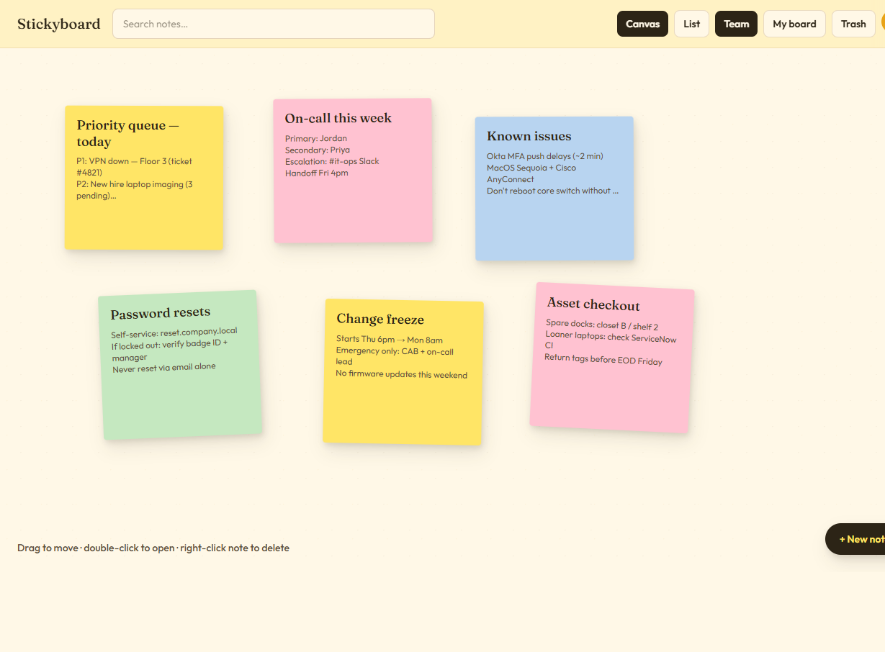

# Stickyboard

Open-source, self-hosted sticky-note dashboard for internal teams. One shared **Team Board**, one **Private Board** per person, cream paper UI, and real-time edit presence.



Design reference: [Figma — Sticky Note Dashboard](https://www.figma.com/design/JPBHDqVS3MlPJd6tNiZRhy)

## Quick start (Docker Compose)

```bash
cp .env.example .env
# edit ADMIN_EMAIL / ADMIN_PASSWORD / BETTER_AUTH_SECRET

docker compose up --build
```

App: http://localhost:3000  
Sign in with your admin credentials from `.env`.

## Local development

```bash
cp .env.example .env
# Ensure Postgres is available at DATABASE_URL (Compose DB or local Postgres)
docker compose up db -d   # optional if using Compose Postgres
npm install
npx prisma migrate deploy
npm run bootstrap
npm run dev
```

Default admin (from `.env`): `admin@example.com` / `changeme123`

## Env vars

| Variable | Purpose |
|----------|---------|
| `DATABASE_URL` | Postgres connection string |
| `BETTER_AUTH_SECRET` | Auth signing secret |
| `BETTER_AUTH_URL` / `APP_URL` | Public app URL |
| `ADMIN_EMAIL` / `ADMIN_PASSWORD` | First admin (bootstrap) |
| `UPLOAD_DIR` | Local attachment storage path |

## What’s in v1 so far

- Email/password auth (Better Auth)
- Env-based first admin + invite copy-links
- Company + private boards
- Canvas with drag, right-click create, maximize editor
- List view + keyword search
- Soft delete / Trash restore; admin purge
- Yellow/cream theme from locked Figma tokens
- Near-live note sync (polling) + real-time edit presence (SSE)

## Still coming

- TipTap rich text + checklist + attachments
- Push-based live board sync (beyond presence)
- Stronger paper-flap motion polish
- Pan/zoom canvas
